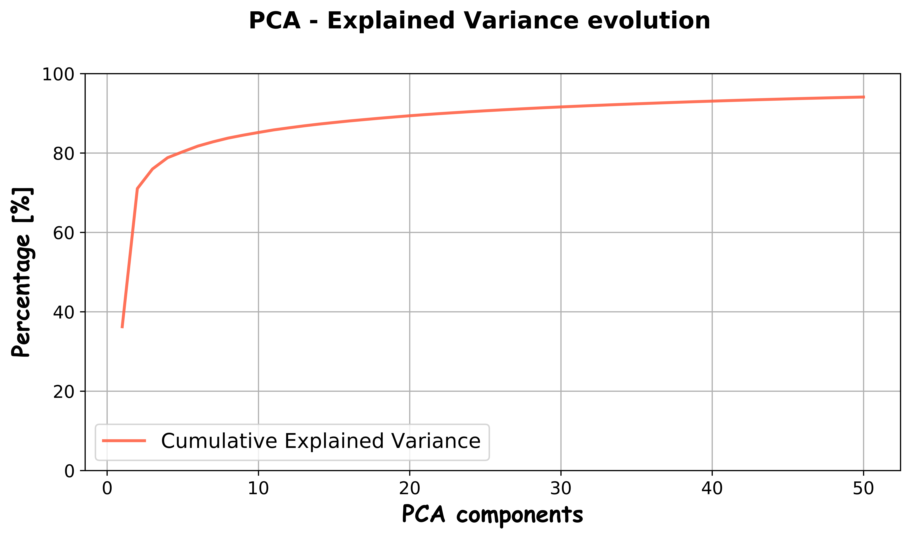
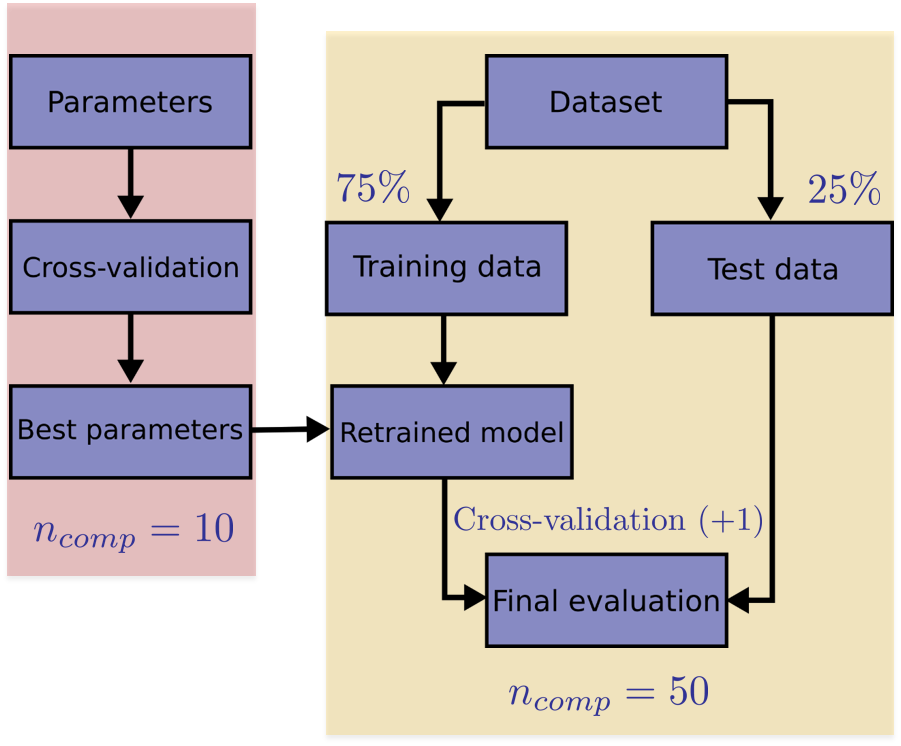

# Machine Learning Face Recognition: a good trip through *multiple dimensions*
*Beto Sibileau.*

*Data Barcelona FT, May 2020*

## Content
- [Project Description](#project-description)
- [Hypotheses / Questions](#hypotheses-questions)
- [Dataset](#dataset)
- [Cleaning](#cleaning)
- [Analysis](#analysis)
- [Model Training and Evaluation](#model-training-and-evaluation)
- [Conclusion](#conclusion)
- [Future Work](#future-work)
- [Workflow](#workflow)
- [Organization](#organization)
- [Links](#links)

## Project Description
This project deals with Machine Learning feature extraction applied to Face Classification in the Extended Yale Face Database. It achieves ... accuracy score for a 38 multilabel classification problem while working on a feature-reduced dimension ... smaller than the original Database.

## Hypotheses / Questions
In image recognition problems such as face classification, a common feature extraction practice applied to the original Databases is Dimensionality Reduction. The reason behind it is that we could ease the Machine Learning classifier task by feeding clustered Data while achieving a significant reduction in the number of features. Note that the total number of image pixels represents the total number of features in our problem. Dimensionality Reduction in the face classification problem is rather intuitive, and states that the features that distinguish different faces are indeed much less than the number of features in the original Database.

Based on the previous, we test two different Dimensionality Reduction techniques, the Principal Component Analysis (PCA) and the kernel-PCA. It is well known that the PCA detects linear correlations between features to reduce the original problem dimensions while keeping the essential information. The kernel-PCA is an extended concept that aims to work also reducing the number of dimensions and keeping the essential information while the relation between features is no longer linear. Given that we do not know the nature of the relation between features in the Face Classification problem, we want to test the performance of this two and derive our own conclussions.

This research question is motivated by the growing interest to build better detection tools for fake and manipulated identities, either built using image editing tools or deep learning based generators.

<!---
* What data/business/research/personal question you would like to answer?
* What is the context for the question and the possible scientific or business application?
* What are the hypotheses you would like to test in order to answer your question?  
Frame your hypothesis with statistical/data languages (i.e. define Null and Alternative Hypothesis). You can use formulas if you want but that is not required.
-->

## Dataset
The research question is workout using the Extended Yale Face Database B, which is described in this [link](http://vision.ucsd.edu/~iskwak/ExtYaleDatabase/ExtYaleB.html) to the UCSD Computer Vision group. This dataset in its cropped version could be downloaded directly [here](http://vision.ucsd.edu/extyaleb/CroppedYaleBZip/CroppedYale.zip). It contains images of 38 people under 64 different ilumination conditions, and discarding the corrupted photos, it accounts for 2414 different entries. All these image data is aligned, which makes it suitable for testing Machine Learning face classification algorithms. All images are grey-scaled and sized 168x192 pixels, which account for a total number of 32256 features in the dataset. The fact that there is a much higher number of features with respect to data entries - $32256 >>> 2414$ - shows the high dimensionality of the dataset.

<!---
* Where did you get your data? If you downloaded a dataset (either public or private), describe where you downloaded it and include the command to load the dataset.
* Did you build your own datset? If so, did you use an API or a web scraper? PRovide the relevant scripts in your repo.
* For all types of datasets, provide a description of the size, complexity, and data types included in your dataset, as well as a schema of the tables if necessary.
* If the question cannot be answered with the available data, why not? What data would you need to answer it better?
-->

## Cleaning
The process of data acquisition is straigthforward in the sense that no cleaning is required to fill missing values or extract outliers from the images database. Once dowloaded, the images for the different people are organized in different folders, which in turn contain the images in `pgm` extension. The image filenames are unique and standardize to denote the belonging person and the different illumination conditions.

The Machine Learning process start by building our matrix of features, denoted by $\mathbf{X}$ and the target vector $\mathbf{y}$. The whole process is built in the `build_dataset.ipynb` Jupyter Notebook file. We use Python modules `os`, `numpy`, `cv2` and `sklearn.preprocessing` to perform a loop in all folders, acquiring the images, transforming them into a `numpy` array, as well as using a `LabelEncoder` to translate the image filenames into a numeric target vector suitable for classification.

<!---
Describe your full process of data wrangling and cleaning. Document why you chose to fill missing values, extract outliers, or create the variables you did as well as your reasoning behind the process.
-->

## Analysis

The first step we worked on data is the feature extraction for future Machine Learning Face Recognition. This process is done through Dimensionality Reduction, which in turn can be seen as an unsupervised Machine Learning process itself. Why? Because it takes the whole matrix of features $\mathbf{X}$ - shape: $(n_{\mathrm{row}}\times n_{\mathrm{col}})$ - as input, and aims to return a reduced matrix of features $\mathbf{\hat{X}}$ - shape: $(\hat{n}_{\mathrm{row}}\times \hat{n}_{\mathrm{col}})$ - with the following characteristics:

* The new representation of the original data is accurate and it is better clustered for Machine Learning classification.
* The number of features in the new representation of data is much less than the original number of features: $\hat{n}_{\mathrm{col}}<<<n_{\mathrm{col}}$

Starting with Principal Component Analysis (PCA), we achieved an outstanding dimensionality reduction over the whole dataset, as described by the evolution of accumulated *explained variance* of data with respect to the number of PCA components. For example, taking only 50 PCA components, we account for $94\%$ of the explained variance in the original dataset, which in turn means only a $0.16\%$ of the original dataset complexity.

Regarding kernel-PCA, we don't have a direct meassure of its performance like the PCA *explained* variance. Instead, we simply use the same number of components predicted by PCA and in addition, we must tune its parameter $\gamma_{kpca}$ performance inside the Machine Learning hyper-parameter tuning phase.

<!---
* Overview the general steps you went through to analyze your data in order to test your hypothesis.
* If you used Machine Learning in your final project, describe your feature selection process.
* Document each step of your data exploration and analysis.
* Include charts to demonstrate the effect of your work.
-->

## Machine Learning: Hyper-parameter Tuning, Model Training and Evaluation

We select the Supported Vector Classifier (SVC) algorithm that is able to perform complex nonlinear decision boundaries for classification using Radial Basis Functions (RBF). This comes however at the expense of tuning two parameters $C$ and $\gamma$. The Machine Learning workflow is handle following the scheme depicted below:

Hyper-parameter tuning is shadowed in red on the left-hand side and the following ingredients are worth to be noted:

* Dimensionality reduction allows us to perform the tuning using a very low number of components, $n_{mathrm{comp}}=10$ only. Although the accuracy of original data representation is lowered, it is sufficient for the model to tune their parameters at an increased speed.
* When using PCA as feature extraction, we only need to train the set of parameters of the SVC classifier: $\{C,\gamma\}$. When k-PCA is used instead, we are required to add an extra parameter in the tuning set on top of the SVC classifier: $\{\gamma_{kpca},C,\gamma\}$

This speeds up the process 

handle following
in the Machine Learning

At their expense, we need to train two additional parameters

<!---
*Include this section only if you chose to include ML in your project.*
* Describe how you trained your model, the results you obtained, and how you evaluated those results.
-->

## Conclusion
* Summarize your results. What do they mean?
* What can you say about your hypotheses?
* Interpret your findings in terms of the questions you try to answer.

## Future Work
Address any questions you were unable to answer, or any next steps or future extensions to your project.

## Workflow
Outline the workflow you used in your project. What were the steps?
How did you test the accuracy of your analysis and/or machine learning algorithm?

## Organization
How did you organize your work? Did you use any tools like a trello or kanban board?

What does your repository look like? Explain your folder and file structure.

## Links
Include links to your repository, slides and trello/kanban board. Feel free to include any other links associated with your project.

[Repository](https://github.com/)  
[Slides](https://slides.com/)  
[Trello](https://trello.com/en)  
